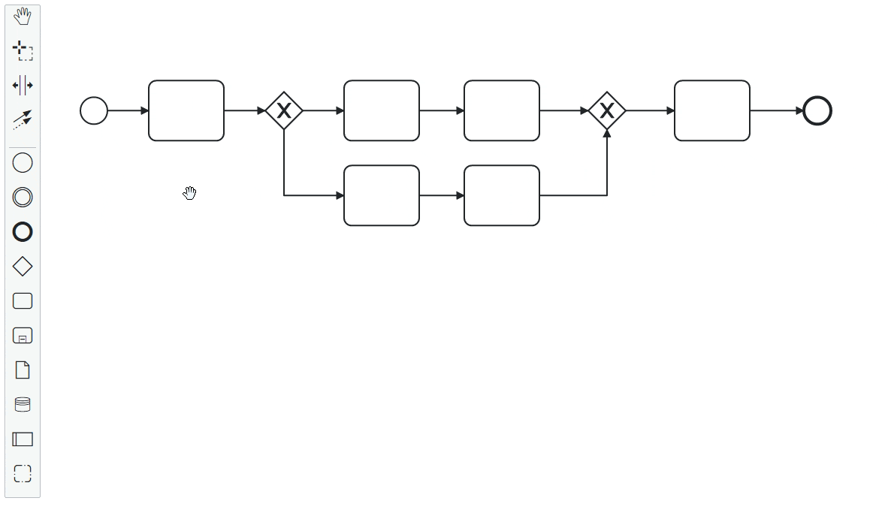

# bpmn-js-move-to-subprocess

This bpmn-js extensions adds the context menu entry to move selected elements
into a subprocess.



The option is only available when the selected elements have a maximum of one
incoming and one outgoing flow. This ensures we don't break the process.

Check out the Demo on [Github Pages](https://marstamm.github.io/bpmn-js-move-to-subprocess/).

## Usage 

Import it as a module into your bpmn-js application:

```javascript
import MoveToSubprocessModule from 'bpmn-js-move-to-subprocess';

const modeler = new BpmnModeler({
  container: '#canvas',
  keyboard: {
    bindTo: window,
  },
  additionalModules: [
    MoveToSubprocessModule,
  ],
});

modeler.importXML(diagramXML);
```

## Development

Run the development server with

```sh
npm run start
```